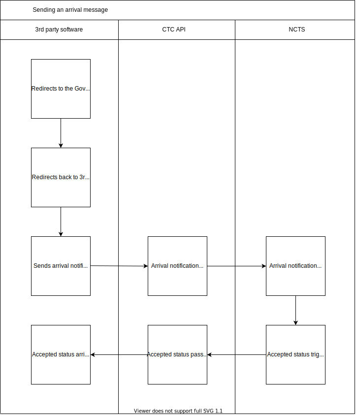

---

# Arrival Notifications: IE007 diagram

Version 0.1 4rd June 2020
***

This diagram shows how an arrival notification message is sent by the user using third party software to the NCTS, using the CTC API.

1. Third party software redirects the user to the Government Gateway for login.   
2  Once authenticated, Government Gateway redirects back to 3rd party software.
3. User sends an Arrival Notification.
4. Arrival Notification message passes through the CTC API.
5. Arrival Notification is received by the NCTS.
6. An accepted status is sent to the CTC Traders API when the NCTS receives the Arrival Notification.
7. The accepted status passes through the CTC Traders API.
8. The accepted status arrives at the third party software to inform the user that the Arrival Notification has been received.
