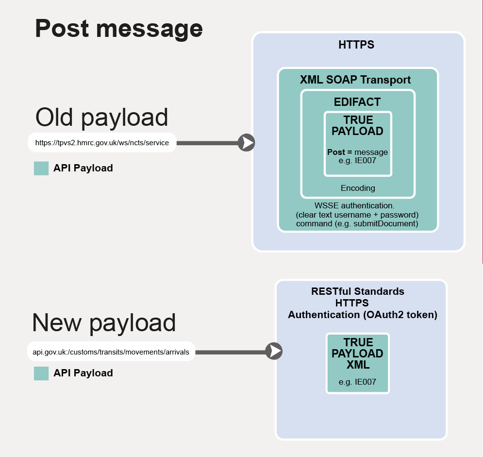

# Common Transit Convention Traders API end-to-end service guide

***

This guide explains how you can use our new Common Transit Convention (CTC) Traders API with your software. The API will allow your software to send and receive movement notifications and status messages to and from the New Computerised Transit System (NCTS).

In 2021, UK traders will need to move from using the NCTS XML API to the new CTC Traders API.

### Come back for regular updates

We are updating this guide as we add more functionality to our API, new technical specifications and other items we hope you find useful.

## Overview

Right now, goods that can move freely within the UK can move across the EU freely too. This will change after the end of the transition period on 31 December 2020. Then, those goods will be subject to duties and other charges when they enter the EU, or enter the UK from the EU.

From 2021, if UK traders want to defer paying these duties and other charges, they can move the goods under the Common Transit Convention. This will allow traders to move goods [across a number of countries](https://www.gov.uk/guidance/common-transit-convention-countries), without having to pay import duties every time they cross a border. They will only have to complete the paperwork and pay any duties they owe, once they reach their destination country.

The API will allow traders to send and receive arrival and departure notifications to customs and border offices.

  

### Why we are creating a new CTC Traders API

Common Transit will be a key procedure for moving goods between the United Kingdom and Europe. This will mean that declaration volumes will increase significantly. In order to make sure we provide a reliable and fast service we are introducing the new CTC Traders API to replace the current NCTS XML API.

### Changes that come with the new CTC Traders API

The table below gives you a brief outline of how the new API uses different coding, compared to the existing NCTS XML API.   

<table>
  <tr>
    <th>Activity</th>
    <th>NCTS XML API</th>
    <th>CTC Traders API</th>
  </tr>
  <tr>
    <th>Submit Arrival Notification (IE007)</th>
    <td>SOAP authorisation (include username and password in clear text)</td>
    <td>Government Gateway authorisation (OAuth2 token)</td>
  </tr>
  <tr>
    <th>Create action</th>
    <td>SOAP wrapper, with embedded instruction</td>
    <td>RESTful interface, action inferred from the URL</td>
  </tr>
  <tr>
    <th>POST API Payload</th>
    <td>SOAP with EDIFACT body</td>
    <td>Information Exchange message (IE) XML</td>
  </tr>
  <tr>
    <th>GET API Payload</th>
    <td>SOAP with EDIFACT body</td>
    <td>JSON and IE XML</td>
  </tr>
</table>
</body>
</html>

  

### Before and after payload diagrams

The diagrams below show the difference between the old EDIFACT and new XML payloads for getting and sending messages. They have different layers of coding. Notice that the new payloads are slimmer, with less layers.

#### Old payload

- The old payload has a top layer of HTTPS.
- The next layer below is XML SOAP transport, this includes and WSSE authentication with a clear text username and password and a command (eg submitDocument).
- Below this layer lies EDIFACT encoding. Then, at the centre is the true payload - eg Post message IE007.  

#### New payload

- The new payload involves at top layer of RESTful standards, HTTPS and OAuth2 token authentication.
- Then we go straight to the central true payload which is XML.

#### Old payload

- The old payload involved a top layer of HTTPS and WSSE authentication.
- The next layer below is XML SOAP transport, this includes WSSE authentication with a clear text username and password and a command (eg getDocument).
- Then, at the centre is the true payload - eg Post message IE007.  

#### New payload

- The new payload involves at top layer of RESTful standards, HTTPS and OAuth2 token authentication.
- Below that, we have a JSON list. Then we go straight to the central true payload payload which is an XML.

  
### Improvements with the CTC Traders API:  
* being ready for the expected increase in CTC movements  
* greatly improving security   
* making it easier to test and maintain  

  
## How to make these changes

### Have a look at the CTC Traders API specifications

**[Review our CTC Traders API specifications](https://developer.service.hmrc.gov.uk/api-documentation/docs/api/service/common-transit-convention-traders/1.0),** endpoints and error messages.

### Run your own tests with CTC Traders Test Support API

**[Look at our CTC Traders Test API specifications](https://developer.service.hmrc.gov.uk/api-documentation/docs/api/service/common-transit-convention-traders-test-support/1.0)** to carry out your own testing.

### Review XSD files

**[Look at our XSD files](documentation/xsd-reference.html)** so you can validate your XML. We are working on an XML field mapping guide and we will share that with you as soon as we can.  

### Check our roadmap

**[See our roadmap](/roadmaps/common-transit-convention-traders-roadmap)** to see what you can test now.

### See the messages we support

**[See the IE messages our API supports](documentation/supported-messages.html)** to get a clear understanding of your tasks with the CTC Traders API.

###  See the NCTS API channel specifications

**[Visit NCTS Phase 4 Technical Interface Specifications (TIS)](https://www.gov.uk/government/publications/new-computerised-transit-system-technical-specifications)** to see a list of messages, message content and sequence diagrams on the .       

Note, this is __NOT__ the specifications document for the new CTC Traders API.  So, there will be discrepancies. For example, the CTC Traders API will not use an EDIFACT wrapper or SOAP.

###  Learn how to apply O-Auth2

**[Understand authorisation](https://developer.service.hmrc.gov.uk/api-documentation/docs/authorisation)** using guidance from the Developer Hub.

### Use Developer Hub tutorials

**[Take advantage of Developer Hub tutorials](https://developer.service.hmrc.gov.uk/api-documentation/docs/tutorials)** to find out what you need to know about working with us.

  
### Find support

We have support in place to help you with any questions or problems you might have to do with the CTC Traders API. [See how we can support you]( https://developer.service.hmrc.gov.uk/guides/common-transit-convention-traders-service-guide/documentation/get-support.html).   

### Check service availability

Before you get in touch, check out whether API downtime or technical issues are the problem. [Check the HMRC API platform availability](https://api-platform-status.production.tax.service.gov.uk).    

  

## End-to-end process

This section shows you how the API fits into various end-to-end user journeys. It aims to help you understand how your software needs to interact with HMRC systems after the changes.

### The path to going live with our API

Here are steps you need to take before you can use your software in the live environment:

1. **Register and subscribe to the Developer Hub**  
[Register for a developer account](https://developer.service.hmrc.gov.uk/developer/registration) and subscribe to the services your need to use.  
2. **Understand Government Gateway authorisation**    
In order to use the CTC Traders API your software needs to interact with [Government Gateway by using OAuth2](https://developer.service.hmrc.gov.uk/api-documentation/docs/authorisation).
3. **Create test user**    
To start testing your software, you need to generate [test users](https://developer.service.hmrc.gov.uk/api-documentation/docs/api/service/api-platform-test-user/1.0).
4. **Download reference data**   
To get Customs Offices List (COL) data to use for testing, [visit the EU's reference data download page](https://ec.europa.eu/taxation_customs/dds2/col/col_download_home.jsp?Lang=en).
5. **Apply to go live**     
You need to apply for production credentials through your [developer account](https://developer.service.hmrc.gov.uk/developer/registration).
6. **Get your customers ready**   
For example, ask them to apply for an [EORI number](https://www.gov.uk/eori) and a [Government Gateway account](https://www.gov.uk/log-in-register-hmrc-online-services).

  

### When these changes are happening

We will release the new CTC Traders API into the NCTS production environment in Spring 2021.

  

### What’s happening for Northern Ireland transit

From 1 January 2021 you’ll be able to use the existing EDIFACT API channel and the email channel to submit departure and arrival messages for both GB and NI NCTS instances.  We’ll automatically route EDIFACT API messages to the appropriate NCTS system without you having to make any changes to your software.

  
## Journey diagrams

Below are two diagrams that give you an overview of the new processes involving the CTC Traders API:

- **[End-to-end happy path diagram](https://developer.service.hmrc.gov.uk/guides/common-transit-convention-traders-service-guide/documentation/end-to-end-happy-path.html)** - See the end-to-end process of transporting goods using the CTC Traders API
- **[Sending an Arrival Notification diagram](https://developer.service.hmrc.gov.uk/guides/common-transit-convention-traders-service-guide/documentation/arrivals-diagram.html)** - See how you send an Arrival Notification to NCTS using the CTC Traders API.   

  

## Related API documentation
<!--- Section owner: MTD Programme --->

  **[CTC Traders API specifications](https://developer.service.hmrc.gov.uk/api-documentation/docs/api/service/common-transit-convention-traders/1.0)**    
  **[CTC Traders Test Support API specifications](https://developer.service.hmrc.gov.uk/api-documentation/docs/api/service/common-transit-convention-traders-test-support/1.0)**    
  **[Create Test User API](https://developer.service.hmrc.gov.uk/api-documentation/docs/api/service/api-platform-test-user/1.0)**   

## Changelog
<!--- Section owner: MTD Programme --->

Version 0.3

11 September 2020

What changed:

- Added more XSD files, link to our roadmap, supported IE messages and a link to our Test API specifications page.  

Version 0.2

6 August 2020

What changed:

- Added detail in reference to the XSD files and a proviso to the NCTS channel specifications (TIS) document

Version 0.1

15 July 2020

* 1st release.
