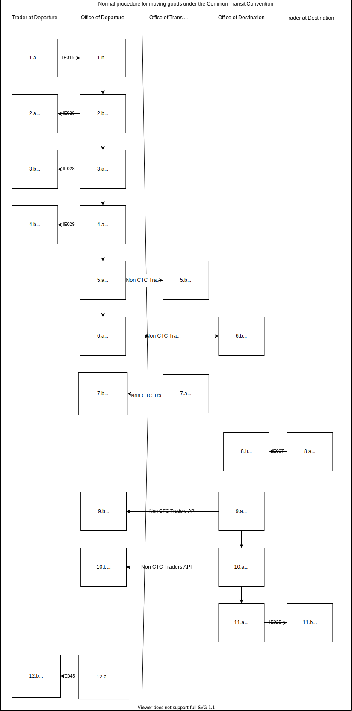

---
# Movements diagram

Version 0.1 3rd June 2020
***

This diagram shows the end-to-end process of transporting goods using the Common Transit Convention API. It shows at what stage in the process each message is sent, and who each message is sent to and from.

1. Trader at departure fills in and sends a declaration notification.
2. Office of departure receives declaration notification.
3. Office of departure sends an acknowledgement of declaration notification.
4. Trader at departure receives acknowledgement notification.
5. Office of departure sends a Movement Reference Number (MRN) for the goods.
6. Trader at departure receives MRN.
7. Office of departure sends notification releasing goods for transit.
8. Office of departure receives notification releasing goods for transit.
9. Office of departure sends a notification to each Office in the countries the goods will pass through in transit.
10. Office(s) of transit receive(s) notification that goods will pass through their border.
11. Office of departure sends a notification to confirm the goods have been released for transit to their Office.
12. Office of destination receives notification that goods are on route to their Office.
13. Office(s) of transit sends a notification to confirm goods have passed through their border.
14. Office of departure receives confirmation that goods have passed through planned borders on their journey.
15. Trader at destination sends a notification to confirm that goods have arrived at their final destination.
16. Office of destination receives confirmation that goods have reached their final destination.
17. Office of destination sends a notification to confirm goods have reached their final destination.
18. Office of departure receives notification that goods have reached their final destination.
19. Office of destination sends notification that goods have passed or failed control checks.
20. Office of departure receives notification that goods have passed or failed control checks.
21. Office of departure sends notification to release the goods from the Office.
22. Trader at destination receives a notification that goods have been released.
23. Office of destination sends notification to confirm that the goods movement is complete.  This confirms that all taxes have been paid.
24. Trader at departure receives notification that the goods movement is complete. Goods are now released to be sold etc.
