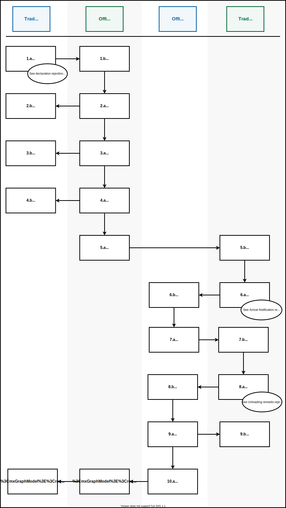
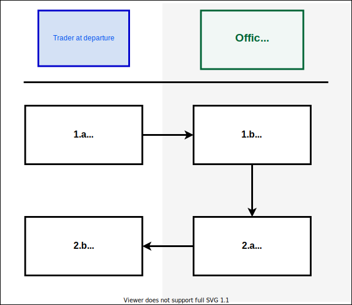
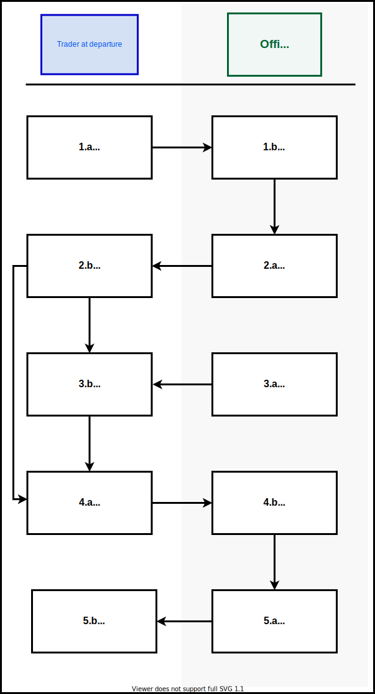
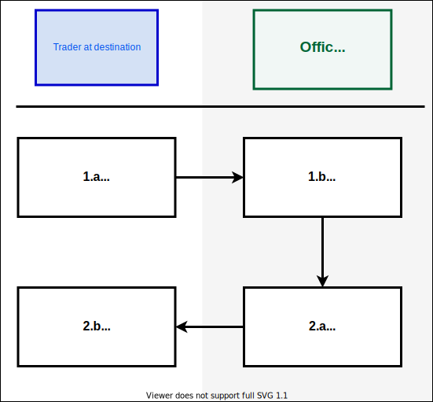
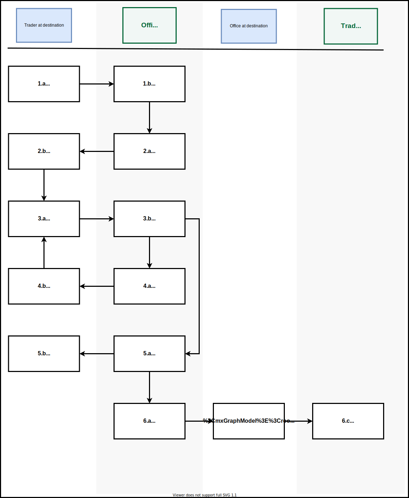

# Diagrams

## Overview diagrams

## End-to-end happy path

Version 0.1 3rd June 2020
***

This diagram shows the end-to-end process of transporting goods using the Common Transit Convention API. It shows at what stage in the process each message is sent, and who each message is sent to and from.

1.a Trader at departure fills in and sends a declaration notification IE015.

1.b Office of departure receives declaration notification.

2.a Office of departure sends an acknowledgement of declaration 1E928.   

2.b Trader at departure receives acknowledgement notification.

3.a Office of departure sends a Movement Reference Number (MRN) IE028.   

3.b Trader at departure receives MRN.

4.a Office of departure sends notification releasing goods for transit IE029.

4.b Office of departure receives notification releasing goods for transit.    

5.a Office of departure sends a notification to each office in the countries the goods will pass through in transit. This does not use the CTC Traders API.  

5.b Office or offices of transit receive notification that goods will pass through their border.   

6.a Office of departure sends a notification to confirm the goods have been released for transit. This does not use the CTC Traders API.   

6.b Office of destination receives notification that goods are on route to their Office.    

7.a Office or offices of transit sends a notification to confirm goods have passed through their border. This does not use the CTC Traders API.   

7.b Office or offices of departure receives confirmation that goods have passed through their borders.    

8.a Trader at destination sends a notification to confirm that goods have arrived at their final destination IE007. This is for simplified procedure only.    

8.b Office of destination receives confirmation that goods have reached their final destination.    

9.a Office of destination sends a notification to confirm goods have reached their final destination. This does not use the CTC Traders API.    

9.b. Office of departure receives notification that goods have reached their final destination.     

10.a Office of destination sends notification that goods have passed or failed control checks. This does not use the CTC Traders API.   

10.b Office of departure receives notification that goods have passed or failed control checks.     

11.a Office of departure sends permission that the goods can be unloaded IE043.   

11.b Trader at destination receives unloading permission.   

12.a Trader at destination sends unloading remarks about the state of the goods.    

12.b Trader a destination receives unloading remarks.   

13.a Office of departure sends notification to release the goods IE025.     

13.b Trader at destination receives a notification that goods have been released.   

14.a Office of destination sends notification to confirm that the goods movement is complete IE045.    

14.b Trader at departure receives notification that the goods movement is complete.  

## Sending an arrivals notification diagram

This diagram shows how an arrival notification message is sent by the user using third party software to the NCTS, using the CTC API.

1. Software redirects the user to the Government Gateway for login.   
2. Once authenticated, Government Gateway redirects back to 3rd party software.
3. User sends an Arrival Notification.
4. Arrival Notification message passes through the CTC API.
5. Arrival Notification is received by the NCTS.
6. An accepted status passes through the CTC Traders API.
7. A message arrives at the third party software to inform the user that the Arrival Notification has been received but not yet processed.

## Diagrams for test scenarios

## Normal procedure

This diagrams shows you the normal procedure, as well as show you other diagrams that go into more details

1.a Trader at departure sends the a Declaration data message IE015. See [Declaration Rejection Diagram](diagrams.html#declaration-rejection-diagram-ie016)    
1.b Declaration is received by the office at departure.   
2.a Office at departure sends back a positive acknowledgement IE928.    
2.b Trader receives the acknowledgement.    
3.a Office at departure sends a Movement Reference Number (MRN)1E028. See [Declaration Cancellation diagram](diagrams.html#declaration-cancellation-request-ie014)    
3.b MRN received by the trader at departure.    
4.a Office at departure sends a release for transit notification IE029. See [Release request rejection diagram](notdoneyet.com)   
4.b Notification is received by the trader at departure.    
5.a Internal customs messages (Not CTC Traders API).    
5.b Good arrive.    
6.a Trader at destination sends the office at destination an arrival notification IE007.       
6.b Notification received.  
7.a Office at arrival sends an unloading permission message IE043.    
7.b Trader at departure receives message.   
8.a Trader at departure sends unloading remarks IE044. See [unloading remarks rejection diagram](notdoneyet.com)    
8.b Remarks received by office at departure.    
9.a Office at departure sends a goods release notification IE025.   
9.b Notification received by trader at departure.   
10.a Internal customs messages (Not CTC Traders API).   
10.b Office at departure sends the trader at departure a write-off notification, movement finished IE045.   
10.c Notification received.   

## Declaration rejection diagram IE016

1.a The trader at departure sends Declaration Data IE015.   
1.b The notification is received by the office at departure.    
2.a The Declaration is rejected IE016.    
2.b The rejection is received by the trader.  

## Declaration cancellation request IE014

1.a Trader at departure sends Declaration Data IE015.   
1.b Office at departure receives notification.    
2.a Office at departure allocates a Movement Reference Number (MRN) IE028.    
2.b MRN is received. Trader can now send a cancellation request IE014.    
3.a Office at departure sends a release of transit message IE029.   
3.b Notification received.    
4.a Trader sends a Declaration cancellation request IE014.    
4.b Office at departure receives cancellation request.    
5.a Office of departure sends a cancellation decision IE009.    
5.b Notification received.

## Arrival notification rejection IE008

1.a The trader at destination sends the office at destination an arrival notification IE007.    
1.b Notification received.    
2.a Office at destination sends the trader at destination an arrival notification rejected message IE008.   
2.b The rejection is received.    

## Unloading remarks rejection IE058

1.a The trader at destination sends the office at destination an arrival notification IE007.    
1.b Notification received.     
2.a Office at destination sends the trader at destination unloading permission IE043.
2.b Permission received.    
3.a Trader at destination sends the office at destination unloading remarks IE044.   
3.b Notification received.    
4.a Office at destination sends the trader at destination an unloading remarks rejected message IE058.    
4.b Trader at destination receives the rejection and amends the unloading remarks message and sends it back to the office at destination.   
5.a Office of destination sends the trader at destination a good release for transit message IE025.   
5.b Notification received.    
6.a Internal customs messages (Not CTC Traders API).    
6.b Office at departure sends the trader at departure a write-off notification, movement finished IE045.       
6.c Notification received.  
